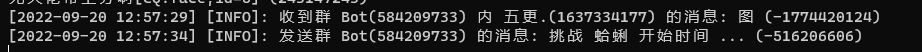
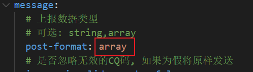
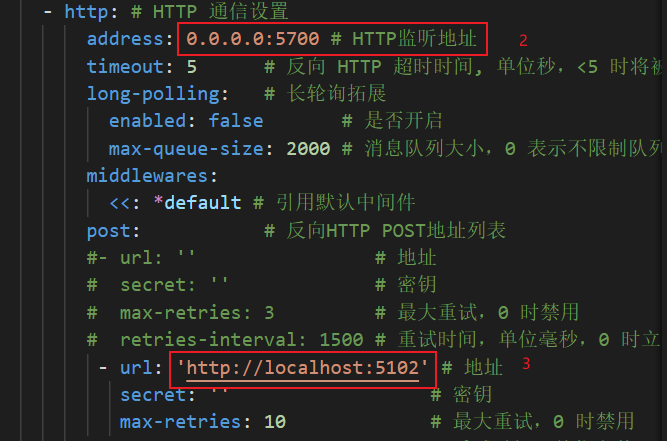

# SplatoonBot

## 简介
用于查询Splatoon3相关数据的QQBot
   
---
## 项目所进行的工作

解析cqhttp传来的文本，确认查询的内容，直接将[splatoon3.ink](https://https://splatoon3.ink/)的内容直接返回。所用的地图名词，图片均为[splatoon3.ink](https://https://splatoon3.ink/)站点所提供。

**目前仅支持群查询。**

### 效果

go-chttp端效果

---

## 部署
### 准备工作
1. 需要成功部署go-cqhttp后,本项目才可以正常工作。具体[go-cqhttp](https://github.com/Mrs4s/go-cqhttp)文档点击此处

go-cqhttp的config.yml配置需要注意的地方
post-format更改为array类型

红框1为CqHttp.URL所要填写的内容（如果不在同一台机器部署，需要更改为go-chttp机器所在地址）

红框2为本项目所在地址（如果不在同一条机器，需要更改为项目所在地址）

### 部署准备
1. 修改appsettings.json
将appsettings.json文件中的CqHttp.URL修改为go-cqhttp的主机地址

2. 将项目正常部署

